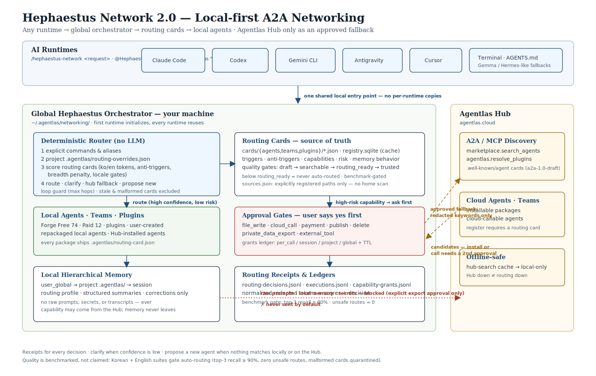

<p align="center">
  <a href="https://agentlas.cloud">
    
  </a>
</p>

<h1 align="center">Hephaestus — the Model-Neutral Agent OS</h1>

<p align="center">
  <strong>An independent operating system for AI agents: build them, brief them, route them, execute with discipline, govern their memory, and move them between any model runtime — as portable, inspectable assets you own.</strong>
</p>

<p align="center">
  <a href="https://github.com/agentlas-ai/Hephaestus/releases/latest">
    
  </a>
  <a href="LICENSE">
    
  </a>
  
</p>

<p align="center">
  <a href="README.md">English</a>
  ·
  <a href="README.ko.md">Korean</a>
  ·
  <a href="README.zh-CN.md">中文</a>
  ·
  <a href="README.ja.md">日本語</a>
  ·
  <a href="README.hi.md">हिन्दी</a>
</p>

<p align="center">
  <a href="#quickstart">Quickstart</a>
  ·
  <a href="#the-command-surface">Commands</a>
  ·
  <a href="#the-os-subsystems">Subsystems</a>
  ·
  <a href="#built-for-the-enterprise">Enterprise</a>
  ·
  <a href="#what-it-builds">What It Builds</a>
  ·
  <a href="#docs-by-goal">Docs</a>
  ·
  <a href="https://agentlas.cloud/desktop">Desktop</a>
</p>

---

## The Agent OS Era

The industry has moved past "chatbots with tools". With Google unveiling its
Agent OS vision at Next 2026, the platform question is settled: agents are
becoming an operating-system-level primitive — long-lived workers with
identity, memory, permissions, and an economy — not features inside one
vendor's app.

That raises the question every serious team now faces: **whose OS do your
agents run on?** If the answer is "whichever model vendor we currently pay",
your agents, their memory, and their operating knowledge are hostages of that
contract.

**Hephaestus is the independent answer.** It is not an agent framework, not an
SDK, and not a wrapper around one model. It is a model-neutral Agent OS: the
layer that owns your agents as portable repository assets and orchestrates
them across whatever model runtimes you choose — Claude Code, Codex, Gemini
CLI, Antigravity, Cursor, OpenCode, local Ollama, or a bare terminal. Swap the
model; keep the workforce.

It maps to an operating system the way you would hope it does:

| OS concept | In Hephaestus |
|---|---|
| Kernel | Deterministic router + policy gates — every decision written as an auditable receipt, execution permissions enforced by the host runtime |
| Processes | Agents and teams as packages with explicit contracts: routing card, permissions, memory behavior, risk profile, verification scripts |
| Scheduler | Network 2.0 routing (local-first, quality-gated, benchmark-gated) + Stormbreaker parallel work-packet execution with a run journal |
| Memory management | Two-boundary governed memory: local project memory that never leaves the machine, and curator-gated promotion for anything durable |
| Filesystem / knowledge | Production Ontology Runtime — local-first source archive, CJK-capable hybrid search, ontology graph, GraphRAG retrieval |
| IPC | A2A agent-card boundary (import/export/caller gates) + MCP surfaces |
| Package manager | Agentlas Hub & Cloud — publish, borrow, and version agents with quality gates and per-call pricing |
| Shell | Six explicit commands in external hosts; plain language in Agentlas-native surfaces |
| Init / process creation | Meta-Agent Factory with a briefing interview gate — agents are specified before they are generated |

<p align="center">
  
</p>

<p align="center">
  <sub>Figure 1. Request shaping, three builders, generated package contracts, memory curation, skill lifecycle, runtime adapters, and sync boundaries.</sub>
</p>

## New In v1.1.0 — the Briefing Interview Engine

Agents built from one vague sentence fail in production. v1.1.0 makes
specification a first-class OS service:

- **Measured ambiguity, not vibes.** An interview loop scores request clarity
  per dimension (goal / constraints / success criteria / context fit) and only
  stops when the composed ambiguity clears a numeric gate (≤ 0.2, per-dimension
  floors, stable across consecutive rounds). Clear requests get **zero
  questions** — the budget system hard-caps interviews so trivial asks are
  never interrogated.
- **Lens-driven questions.** Questions come from a curated lens table
  (scope / system / intent / challenge), including the three that matter most
  for routing quality: *what must this agent NOT do* (anti-scope), *what does
  done look like*, and *what result means stop*.
- **The Work Brief.** Interviews freeze into `.agentlas/work-brief.json` — a
  one-line confirmed goal, constraints, verifiable acceptance criteria,
  anti-scope, an assumption ledger with source tags, and the final ambiguity
  score stamped in metadata.
- **The brief rides everywhere.** `cards migrate` derives routing-card
  triggers and anti-triggers from the user's own confirmed words (always
  better than a generated guess). `route --brief` extends Stormbreaker stage
  detection and attaches the brief to every execution packet, so constraints
  and exit conditions survive into parallel work instead of dying with the
  first chat turn.
- **Sharper routing discrimination.** Same-topic/different-intent hijacking
  (a compliance agent grabbing a copywriting request) is now countered at both
  ends: interview-confirmed anti-triggers on the card, and an anti-trigger
  penalty plus low-confidence LLM re-ranking escalation in the router.

## Quickstart

### Paste-to-install (let your AI do it)

Paste this into Claude Code, Codex, Gemini CLI, Antigravity, or Cursor:

```text
Install Hephaestus Agentlas for this workspace from this GitHub repo:
https://github.com/agentlas-ai/Hephaestus

Use the latest release/instructions. If anything errors, diagnose and fix it,
retry, and confirm which command surface is active in this tool:
- Agentlas Terminal / Desktop route plain language natively.
- External LLM hosts expose exactly six commands: build, network, cloud,
  search, call, upload.
```

### Fresh macOS check

```bash
xcode-select --install   # command line tools (skip if already installed)
git --version            # confirm git is available
```

### One terminal command for all runtimes

```bash
curl -fsSL https://raw.githubusercontent.com/agentlas-ai/Hephaestus/main/scripts/install-all-runtimes.sh | bash
```

This installs the neutral runner at `~/.agentlas/runtime/current/bin/hephaestus`
and registers the command surface for Claude Code, Codex, Gemini CLI,
Antigravity, and Cursor. The installer verifies each runtime surface after
registration.

### Per-runtime plugin installs

<details>
<summary>Claude Code plugin</summary>

From your OS terminal:

```bash
claude plugin marketplace add https://github.com/agentlas-ai/Hephaestus --sparse .claude-plugin claude/plugins
claude plugin install hephaestus@agentlas-core-engine
```

Claude also supports `claude plugins ...` as an alias, but this README uses
`claude plugin ...` everywhere so the command shape stays consistent.

</details>

<details>
<summary>Codex plugin</summary>

From your OS terminal:

```bash
codex plugin marketplace add agentlas-ai/Hephaestus --ref v1.1.0
codex plugin add hephaestus@agentlas-core-engine
```

Codex does not accept `/plugin marketplace add` inside the app — run the two
commands above in your OS terminal. The OS-terminal CLI command is singular
(`codex plugin`); inside the Codex app, the plugin browser slash command is
plural (`/plugins`). After install, `/prompts:hep-build` is the in-app entry.

</details>

<details>
<summary>Copy files into a project</summary>

Clone the repo and copy `AGENTS.md`, `agent.md`, `agents/`, `skills/`,
`modes/`, `schemas/`, `templates/`, and `.agentlas/` into your workspace.
Runtime folders (`.claude/`, `codex/`, `.gemini/`, `.agents/`) are adapters
over the same canonical core.

</details>

After install, just talk: in Agentlas surfaces describe the work in plain
language; in external hosts use the six commands below. When you don't know
what agents exist, start with `/hep-search`.

## The Command Surface

Agentlas-native surfaces are commandless. External LLM hosts keep a
deliberately small surface — six commands; Stormbreaker, research loadouts,
and lower-level tooling attach automatically from context:

| Job | Command | Example |
|---|---|---|
| Create | `/hep-build` | `/hep-build create a customer support agent for Shopify refunds` |
| Borrow | `/hep-network` | `/hep-network split this launch plan into research, copy, QA, and release agents` |
| Share | `/hep-cloud` | `/hep-cloud use my saved finance analyst agent to review this report` |
| Search | `/hep-search` | `/hep-search find agents for a market report workflow` |
| Call | `/hep-call` | `/hep-call market-researcher, report-writer {draft a market report}` |
| Upload | `/hep-upload` | `/hep-upload ./agents/customer-support-hq` |

## The OS Subsystems

### Meta-Agent Factory — process creation

Three builders, one contract. Every generated package registers its global
command (`.agentlas/global-commands.json`) and ships verification scripts —
the user never has to infer how to run what was built.

| You ask for | It routes to | You get |
|---|---|---|
| "Make one agent that does X" | `10-single-agent-builder` | One installable worker with skills, memory contracts, runtime adapters, and verification |
| "Make a team/company for this workflow" | `20-multi-agent-team-builder` | A multi-role operating team with HQ, PM Soul, Memory Curator, Policy Gate, eval, QA, and handoffs |
| "Package this existing agent/repo/workspace" | `30-agentlas-packager` | A cleaned Agentlas package for Desktop import, terminal use, Codex, Claude, Gemini, or public GitHub release |

Builds start with the **briefing interview gate**
([docs/builder-interview-research-gate.md](docs/builder-interview-research-gate.md)):
lens-driven batched questions, a numeric stop rule, research of primary
sources and comparables, then generation — and the interview's Work Brief
becomes the routing card's triggers and anti-triggers verbatim.

### Network 2.0 — the scheduler

<p align="center">
  
</p>

<p align="center">
  <sub>Figure 2. Runtimes, the global local-first orchestrator, routing cards, local memory, and the Agentlas Hub A2A/MCP fallback.</sub>
</p>

- **Routing cards.** Every agent, team, and plugin ships a standardized card:
  triggers, anti-triggers, capabilities, risk profile, memory behavior. Cards
  that fail quality gates are never auto-routed.
- **Local first.** Explicit commands → project overrides → your local cards.
  The Agentlas Hub is a fallback that only ever receives redacted keywords —
  never your raw prompt.
- **Temporary task forces.** Composite requests decompose into Hub/local task
  force plans with Stormbreaker packets, session hints, ontology graph paths,
  and policy labels — each named specialist in a request is borrowed, with a
  temporary orchestrator formation when several work at once.
- **Receipts, not execution.** Every routing decision writes a receipt. The
  router selects; the host runtime enforces permissions when tools execute.
- **Measured, not claimed.** A bilingual routing benchmark gates auto-routing:
  top-3 recall ≥ 90%, zero unsafe routes in the privacy suite. Low-confidence
  decisions escalate to a host-run Router Agent re-ranking pass instead of
  dead-ending.

Details: [docs/hephaestus-network-2.0.md](docs/hephaestus-network-2.0.md) ·
runtime matrix: [docs/runtime-fallback-adapters.md](docs/runtime-fallback-adapters.md)

### Stormbreaker — disciplined execution

Stormbreaker keeps agent work from *looking* done before it is verified:
scope-lock → decomposition → parallel work packets → verify → bounded repair →
final gate. A run journal makes long executions resumable after interruption,
and packets carry the Work Brief so constraints and exit conditions apply to
every parallel worker. It reports **verified / unverified / blocked** — never
autonomous-completion theater.

Protocol: [docs/robustness-protocol.md](docs/robustness-protocol.md) ·
evals: [docs/robustness-eval.md](docs/robustness-eval.md)

### Ontology Runtime — the knowledge filesystem

For knowledge-heavy agents, `bin/ontology` turns approved local files into an
agent-readable stack — source archive, chunk store, CJK-capable FTS + vector
hybrid search fused with RRF, an ontology graph with lineage and confidence,
GraphRAG retrieval, Memory Curator candidate tickets, and per-agent working
memory. First-party Korean document parsing (HWPX and legacy HWP5) with no
GPL parser dependencies. Runs on SQLite, fully local; private/confidential
chunks never reach cloud hooks.

```bash
bin/ontology ingest ./corpus --scope internal
bin/ontology query "Project Helios Memory Curator" --agent verifier
bin/ontology memory candidates
```

Details: [docs/ontology-runtime.md](docs/ontology-runtime.md)

### Governed Memory — two boundaries, curated promotion

- **Local project memory** lives in `~/.agentlas/networking/` and never leaves
  the machine without explicit export approval.
- **Workspace personalization** (for borrowed Cloud/Hub agents) stores only
  promoted summaries, playbooks, plugin locks, and retrieval receipts — never
  raw prompts, transcripts, secrets, or private files.
- **Nothing becomes durable by itself.** Skills and memories are candidates
  until a Curator sees execution evidence, holdout/replay proof, rollback
  coverage, and policy approval. Approval records review state; promotion is a
  separate, owned step.

### A2A Boundary — interop without leakage

```bash
agentlas-cloud ao a2a import ./agent-card.json .
agentlas-cloud ao a2a export . --agent local/10-builder
agentlas-cloud route "run the release check" --caller local/orchestrator .
```

Import is a proposal (never grants invocation), export is whitelist-only
(private paths and policy rationale redacted), and invocation is caller-gated
before a route is ever selected.

## Built For The Enterprise

An enterprise does not need another way to write an agent in Python. It needs
to **operate a workforce** of them. That is an OS problem, and it is where
Hephaestus is opinionated:

- **Model neutrality is procurement leverage.** Agents, their memory, their
  knowledge bases, and their operating history live as repository assets under
  your control. Changing model vendors is a config change, not a migration.
- **Auditability by construction.** Routing receipts, execution journals,
  memory tickets, and curator decision ledgers are files you can diff, review,
  and retain. A run either verified its work or says so.
- **Governance gates, not guidelines.** Policy gates, permission boundaries,
  anti-trigger discrimination, public-safety checks, and redaction-by-default
  Hub queries are enforced in the pipeline — not requested in a prompt.
- **Specification before generation.** The briefing interview engine makes
  ambiguity measurable and stamps the score on the spec, so "the agent did the
  wrong thing" is auditable back to what was actually agreed.
- **Local-first data boundary.** Raw prompts, source documents, and project
  memory stay on your machines. What leaves is redacted, receipted, and
  opt-in.

**Where the frameworks fit:** CrewAI, LangChain, and vendor agent SDKs are
libraries — excellent for writing agent logic inside one application and one
process. Hephaestus operates one level below and above them: it is the
substrate that specifies, packages, routes, executes, audits, and ports
agents across runtimes. Framework code can live inside a Hephaestus package;
the OS doesn't care what an agent is written in, only that it honors its
contracts.

## What It Builds

Hephaestus leaves behind a repository another runtime can inspect, install,
verify, and keep improving:

```text
AGENTS.md                          # canonical route
agent.md / agents/                 # single worker or team roles
skills/  modes/  schemas/  templates/
.agentlas/                         # routing card, work brief, global commands,
                                   # memory contracts, eval plan
.claude/  codex/  .gemini/  .agents/   # runtime adapters over one core
scripts/verify-package.sh
scripts/public_safety_check.sh
docs/                              # builder interview, research sources,
                                   # tool selection, prompt contract
```

## Docs By Goal

| Goal | Start here |
|---|---|
| Understand the canonical route | [`AGENTS.md`](AGENTS.md) |
| See the full team contract | [`agent.md`](agent.md) |
| Architecture source of truth | [`docs/source-of-truth.md`](docs/source-of-truth.md) |
| Runtime boundaries | [`docs/runtime-sync-boundaries.md`](docs/runtime-sync-boundaries.md) |
| Briefing interview & research gate | [`docs/builder-interview-research-gate.md`](docs/builder-interview-research-gate.md) |
| Network 2.0 routing | [`docs/hephaestus-network-2.0.md`](docs/hephaestus-network-2.0.md) |
| Stormbreaker protocol | [`docs/robustness-protocol.md`](docs/robustness-protocol.md) |
| Ontology runtime | [`docs/ontology-runtime.md`](docs/ontology-runtime.md) |
| Memory architecture | [`docs/memory-architecture.md`](docs/memory-architecture.md) |
| Skill lifecycle promotion | [`docs/skill-lifecycle-promotion.md`](docs/skill-lifecycle-promotion.md) |
| Cloud runtime bundles | [`docs/agentlas-cloud-runtime.md`](docs/agentlas-cloud-runtime.md) |
| Verify a package | [`scripts/verify-package.sh`](scripts/verify-package.sh) |
| Public safety check | [`scripts/public_safety_check.sh`](scripts/public_safety_check.sh) |

## Public Safety Boundary

This repo intentionally does **not** include hosted Agentlas billing/account
logic, production credentials, customer data, raw private logs, raw
transcripts, desktop keychain storage, local database implementation, or
private deployment configuration.

Public output packages must not include local machine paths, API keys, tokens,
private keys, service-account JSON, `.env` secrets, private research notes,
raw chat transcripts, customer logs, or hosted billing/account/OAuth internals.

## Contributing

Before opening a PR or publishing a release, run:

```bash
scripts/verify-package.sh
scripts/verify-ontology-runtime.sh
scripts/public_safety_check.sh
```

## License

Apache-2.0. See [LICENSE](LICENSE).
