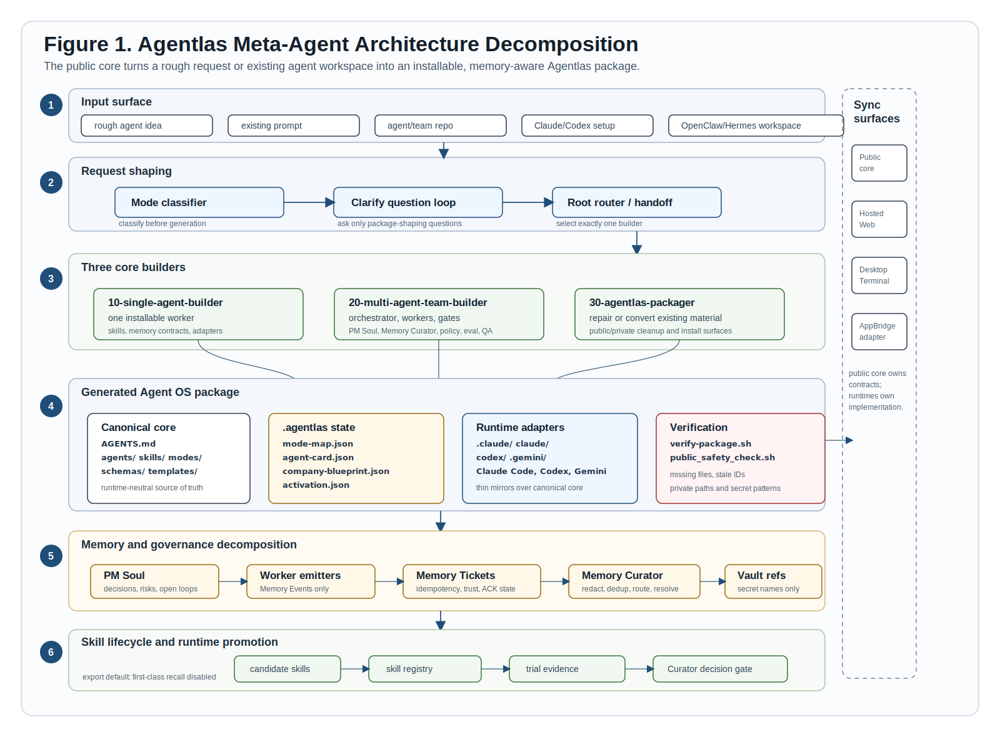

<p align="center">
  <a href="https://agentlas.cloud">
    
  </a>
</p>

<h1 align="center">agentlas-meta-agent</h1>

<p align="center">
  <strong>Turn one rough agent idea into an installable agent operating system.</strong>
</p>

<p align="center">
  Build one specialist, assemble a multi-agent team, or package an existing Claude/Codex/OpenClaw/Hermes workspace into a public-safe Agentlas repo.
</p>

<p align="center">
  <a href="https://github.com/jeongmk522-netizen/agent_agentlas_core_engine_meta_agent/releases/latest">
    
  </a>
  <a href="LICENSE">
    
  </a>
  
  
</p>

<p align="center">
  <a href="#quickstart">Quickstart</a>
  ·
  <a href="#what-it-builds">What It Builds</a>
  ·
  <a href="#architecture">Architecture</a>
  ·
  <a href="#features">Features</a>
  ·
  <a href="#compare">Compare</a>
  ·
  <a href="#docs-by-goal">Docs</a>
  ·
  <a href="https://agentlas.cloud">agentlas.cloud</a>
</p>

<p align="center">
  <a href="#ko">한국어</a>
  ·
  <a href="#zh">中文</a>
  ·
  <a href="#en">English</a>
  ·
  <a href="#ja">日本語</a>
  ·
  <a href="#hi">हिन्दी</a>
</p>

<p align="center">
  
</p>

<p align="center">
  <sub>Figure 1. Architecture decomposition: request shaping, three core builders, generated package contracts, memory curation, skill lifecycle, runtime adapters, and sync boundaries.</sub>
</p>

---

## Quickstart

Start with **Agentlas Terminal** or **Agentlas Desktop** if you want the full Agentlas runtime. Use the standalone **agentlas-meta-agent** install only when you want to register the package directly inside Claude Code/Codex or drop the files into a plain `AGENTS.md` project.

> **Note:** Steps 1 and 3 include `agentlas-meta-agent` in the Agentlas runtime path. Step 2 is for standalone file installs and Claude/Codex plugin registration.

### 1. Download Agentlas Terminal

Agentlas Terminal is installed from the Agentlas Desktop build. Install the app, then open **Settings -> Use from the terminal (`agentlas` CLI) -> Install CLI**.

**macOS**

```bash
arch=$([ "$(uname -m)" = "arm64" ] && echo arm64 || echo x64)
curl -fL "https://agentlas.cloud/api/desktop/download?arch=${arch}" -o Agentlas.dmg
open Agentlas.dmg
```

**Windows PowerShell**

```powershell
$r = Invoke-RestMethod https://api.github.com/repos/jeongmk522-netizen/agentlas-desktop/releases/latest
$u = ($r.assets | Where-Object { $_.name -like '*Windows-x64-Setup.exe' }).browser_download_url
Invoke-WebRequest $u -OutFile "$env:TEMP\AgentlasSetup.exe"
Start-Process "$env:TEMP\AgentlasSetup.exe"
```

**Linux AppImage**

```bash
url=$(curl -fsSL https://api.github.com/repos/jeongmk522-netizen/agentlas-desktop/releases/latest \
  | grep -o 'https://[^"]*Linux-x64\.AppImage' | head -1)
curl -fL "$url" -o Agentlas.AppImage
chmod +x Agentlas.AppImage
./Agentlas.AppImage
```

**Linux Debian/Ubuntu**

```bash
url=$(curl -fsSL https://api.github.com/repos/jeongmk522-netizen/agentlas-desktop/releases/latest \
  | grep -o 'https://[^"]*Linux-x64\.deb' | head -1)
curl -fL "$url" -o agentlas.deb
sudo dpkg -i agentlas.deb
```

After installing the CLI from Settings:

```bash
agentlas list
agentlas run agentlas-meta-agent "Package this workflow for Agentlas"
```

### 2. Install agentlas-meta-agent Standalone

#### Simple File Install

**macOS / Linux / Windows Git Bash or WSL**

```bash
curl -fsSL https://raw.githubusercontent.com/jeongmk522-netizen/agent_agentlas_core_engine_meta_agent/v0.1.3/scripts/install.sh | bash
scripts/verify-package.sh
scripts/public_safety_check.sh
```

**Windows PowerShell**

```powershell
$zip = "$env:TEMP\agentlas-meta-agent-v0.1.3.zip"
$extract = "$env:TEMP\agentlas-meta-agent-v0.1.3"
Invoke-WebRequest "https://github.com/jeongmk522-netizen/agent_agentlas_core_engine_meta_agent/archive/refs/tags/v0.1.3.zip" -OutFile $zip
Remove-Item $extract -Recurse -Force -ErrorAction SilentlyContinue
Expand-Archive $zip -DestinationPath $extract -Force
$src = Get-ChildItem $extract -Directory | Select-Object -First 1
Get-ChildItem $src.FullName -Force | Copy-Item -Destination (Get-Location) -Recurse -Force
```

#### Register Marketplace, Then Install Plugin

**Claude Code shell**

```bash
claude plugin marketplace add https://github.com/jeongmk522-netizen/agent_agentlas_core_engine_meta_agent --sparse .claude-plugin claude/plugins
claude plugin install agentlas-meta-agent@agentlas-core-engine
```

**Claude Code slash commands**

```text
/plugin marketplace add https://github.com/jeongmk522-netizen/agent_agentlas_core_engine_meta_agent --sparse .claude-plugin claude/plugins
/plugin install agentlas-meta-agent@agentlas-core-engine
/reload-plugins
/plugin list
```

Expected result:

```text
✓ Installed agentlas-meta-agent. Run /reload-plugins to apply.
Reloaded: 1 plugin · 0 skills · 9 agents · 0 hooks · 0 plugin MCP servers · 0 plugin LSP servers
```

**Codex shell**

```bash
codex plugin marketplace add jeongmk522-netizen/agent_agentlas_core_engine_meta_agent --ref v0.1.3
codex plugin list
codex plugin add agentlas-meta-agent@agentlas-core-engine
codex plugin list
```

**Codex slash commands**

```text
/plugin marketplace add jeongmk522-netizen/agent_agentlas_core_engine_meta_agent --ref v0.1.3
/plugin install agentlas-meta-agent@agentlas-core-engine
/reload-plugins
/plugin list
```

Expected result:

```text
✓ Installed agentlas-meta-agent. Run /reload-plugins to apply.
Reloaded: 1 plugin · 0 skills · 9 agents · 0 hooks · 0 plugin MCP servers · 0 plugin LSP servers
```

If a Codex session is already open, run `/reload-plugins` or start a new session so the plugin is loaded.

### 3. Install Agentlas Desktop

Download from:

```text
https://agentlas.cloud/desktop
```

Desktop gives you the visual Agentlas surface: local projects, agents, teams, Apps, vault, runtime selection, built-in Core Engine Meta-Agent routing, and the `agentlas` CLI installer.

## What It Builds

`agentlas-meta-agent` does not stop at a prompt. It leaves behind a repo that another runtime can inspect, install, verify, and keep improving.

| You ask for | It routes to | You get |
|---|---|---|
| "Make one agent that does X" | `10-single-agent-builder` | One installable worker with skills, memory contracts, runtime adapters, and verification |
| "Make a team/company for this workflow" | `20-multi-agent-team-builder` | A multi-role operating team with HQ, PM Soul, Memory Curator, Policy Gate, eval, QA, and handoffs |
| "Package this existing agent/repo/workspace" | `30-agentlas-packager` | A cleaned Agentlas package for Desktop import, terminal use, Codex, Claude, Gemini, or public GitHub release |

Generated or repaired packages can include:

```text
AGENTS.md
CLAUDE.md
GEMINI.md
agent.md
agents/
skills/
modes/
.agentlas/
.agents/
.claude/
.gemini/
codex/
schemas/
templates/
scripts/verify-package.sh
scripts/public_safety_check.sh
```

## Architecture

The public core is the architecture and foldering contract. Runtime-specific folders are adapters over the same core, not separate sources of truth. Figure 1 decomposes the flow from request shaping to generated package contracts, memory governance, skill promotion, and runtime sync boundaries.

This architecture update promotes four pieces into the public contract:

| Public contract | What it does |
|---|---|
| Mode auto-detection | Chooses `single-agent-creator`, `team-builder`, or `agentlas-packager` before generation |
| Clarify question loop | Asks only the package-shaping questions that affect runtime, public boundary, tools, or safety |
| `.agentlas` auto-activation | Lets local runtimes seed project memory, sitemap/task-bias, Memory Tickets, and vault references when a folder becomes an Agentlas workspace |
| Skill lifecycle registry | Ships skills as candidate metadata first, with trial ledgers and Curator decisions before first-class recall |

## Features

| Feature | Why it matters |
|---|---|
| **Three-mode router** | A single worker, a full team, and an existing-agent package are different jobs. The router keeps them separate. |
| **Visible role folders** | Users can inspect the actual builders, skills, modes, schemas, and generated contracts instead of trusting hidden orchestration. |
| **Memory Tickets** | Durable memory is proposed, redacted, deduplicated, and ACKed instead of silently dumped into a prompt. |
| **PM Soul continuity** | Generated teams can preserve project decisions, open loops, risks, and handoff context between sessions. |
| **Policy, eval, and QA gates** | Teams can include release checks and evidence gates instead of role lists with no accountability. |
| **Skill lifecycle promotion** | Reusable skills start as candidates. First-class recall requires Curator review, evidence, rollback, and workspace policy. |
| **Runtime adapters** | The same core can be read by Codex, Claude Code, Gemini CLI, Cursor-style tools, and generic `AGENTS.md` runtimes. |
| **Desktop and terminal built-in path** | Agentlas Desktop and `agentlas` CLI can route core meta-agent work locally without requiring a separate public package install. |
| **Public-safe release checks** | `verify-package.sh` and `public_safety_check.sh` catch missing contracts, stale IDs, private paths, and common secret patterns. |

## Why This Exists

Most AI tools can generate a good answer. The harder problem is keeping the agent alive after the chat ends.

`agentlas-meta-agent` closes that gap:

- from idea to installable repo;
- from one Claude-only helper to a portable Claude/Codex/Gemini/AGENTS.md package;
- from local OpenClaw/Hermes-style workspace to Agentlas Desktop-ready import;
- from a role list to a team with memory, policy, eval, QA, install, and release checks;
- from self-improvement claims to skill lifecycle evidence that can be reviewed.

## Desktop And Terminal

Agentlas Desktop and Agentlas Terminal are the easiest path when you want the full local runtime.

Use Desktop for:

- visual project, agent, team, Apps, and vault surfaces;
- local runtime selection across Claude Code, Codex, Gemini, BYOK, and local runners;
- importing or opening packages produced by this meta-agent;
- seeing team structure and project continuity instead of only terminal logs.

Use Terminal for:

- running the same agents from a shell;
- packaging a workflow without leaving the repo;
- moving between local files, Codex, Claude Code, and Agentlas Desktop.

```bash
agentlas list
agentlas run agentlas-meta-agent "Build a launch research team with PM Soul, QA, and public release checks"
cd "$(agentlas cd agentlas-meta-agent)"
```

## Standalone Install

Use standalone install when you want this repo directly in Claude Code, Codex, or a plain project folder.

### Claude Code

```bash
claude plugin marketplace add https://github.com/jeongmk522-netizen/agent_agentlas_core_engine_meta_agent --sparse .claude-plugin claude/plugins
claude plugin install agentlas-meta-agent@agentlas-core-engine
```

Local checkout option:

```bash
git clone https://github.com/jeongmk522-netizen/agent_agentlas_core_engine_meta_agent.git
cd agent_agentlas_core_engine_meta_agent
claude plugin marketplace add ./claude
claude plugin install agentlas-meta-agent@agentlas-core-engine
```

### Codex

```bash
codex plugin marketplace add jeongmk522-netizen/agent_agentlas_core_engine_meta_agent --ref v0.1.3
codex plugin add agentlas-meta-agent@agentlas-core-engine
codex plugin list
```

### Plain Project Folder

```bash
curl -fsSL https://raw.githubusercontent.com/jeongmk522-netizen/agent_agentlas_core_engine_meta_agent/v0.1.3/scripts/install.sh | bash
scripts/verify-package.sh
scripts/public_safety_check.sh
```

## Use It

Single agent:

```text
/meta-agent Create a research agent for SEC filing analysis.
Package it for Codex, Claude Code, Gemini, and Agentlas Desktop.
```

Multi-agent team:

```text
Use agentlas-meta-agent.
Build a customer-support operations team with PM Soul, Memory Curator, Policy Gate, QA, eval, and public-safe release checks.
```

Package an existing workspace:

```text
Package this local OpenClaw/Hermes-style workspace into Agentlas architecture.
Keep private notes, machine paths, raw logs, and secrets out of the public repo.
```

## Compare

| Compared with | Their strength | What `agentlas-meta-agent` adds |
|---|---|---|
| OpenAI / Codex | Strong models and coding terminal | Portable repo contracts, `.agentlas` memory/package files, skills, schemas, runtime adapters, and public verification |
| Claude / Claude Code | Strong reasoning and Claude-native workflows | Claude support without becoming Claude-only; Codex, Gemini, Desktop, terminal, and `AGENTS.md` stay aligned |
| OpenClaw | Local identity and workspace agent loop | Visible role folders, Agentlas package contracts, public-safety checks, Desktop import, vault references, and install surfaces |
| Hermes | Persona and memory-centered local agent runtime | PM Soul, Memory Tickets, sitemap/task-bias, policy/eval/QA, and skill lifecycle evidence as files |

OpenAI and Claude are model/runtime surfaces. OpenClaw and Hermes are local-agent experiences. `agentlas-meta-agent` is the package layer that makes agents portable, inspectable, installable, and publishable.

## Docs By Goal

| Goal | Start here |
|---|---|
| Understand the canonical route | [`AGENTS.md`](AGENTS.md) |
| See the full team contract | [`agent.md`](agent.md) |
| See the architecture source of truth | [`docs/source-of-truth.md`](docs/source-of-truth.md) |
| Understand runtime boundaries | [`docs/runtime-sync-boundaries.md`](docs/runtime-sync-boundaries.md) |
| Choose a mode | [`docs/mode-classifier.md`](docs/mode-classifier.md) |
| Ask the right setup questions | [`docs/clarify-question-loop.md`](docs/clarify-question-loop.md) |
| Activate local `.agentlas` workspace files | [`docs/agentlas-auto-activation.md`](docs/agentlas-auto-activation.md) |
| Review skill lifecycle promotion | [`docs/skill-lifecycle-promotion.md`](docs/skill-lifecycle-promotion.md) |
| Understand runtime architecture | [`docs/llm-runtime-architecture.md`](docs/llm-runtime-architecture.md) |
| Understand memory architecture | [`docs/memory-architecture.md`](docs/memory-architecture.md) |
| Operate PM Soul | [`docs/pm-soul-operating-loop.md`](docs/pm-soul-operating-loop.md) |
| Verify a package | [`scripts/verify-package.sh`](scripts/verify-package.sh) |
| Check public safety | [`scripts/public_safety_check.sh`](scripts/public_safety_check.sh) |

## Public Safety Boundary

This repo intentionally does **not** include hosted Agentlas billing/account logic, production credentials, customer data, raw private logs, raw transcripts, desktop keychain storage, local database implementation, or private deployment configuration.

Public output packages should not include:

- local machine paths;
- API keys, tokens, private keys, service-account JSON, or `.env` secrets;
- private research notes;
- raw chat transcripts;
- customer or production logs;
- hosted billing, account, OAuth, desktop storage, or deployment internals.

## Localized Quick Starts

<h3 id="ko">한국어</h3>

`agentlas-meta-agent`는 아이디어 하나를 설치 가능한 Agentlas agent/team repo로 바꾸는 메타 에이전트입니다. Agentlas Desktop 또는 Terminal을 쓰면 이 경로가 내장되어 있고, Claude/Codex에 직접 설치하려면 아래처럼 marketplace 등록 후 plugin을 설치합니다.

```bash
claude plugin marketplace add https://github.com/jeongmk522-netizen/agent_agentlas_core_engine_meta_agent --sparse .claude-plugin claude/plugins
claude plugin install agentlas-meta-agent@agentlas-core-engine
```

```bash
codex plugin marketplace add jeongmk522-netizen/agent_agentlas_core_engine_meta_agent --ref v0.1.3
codex plugin add agentlas-meta-agent@agentlas-core-engine
```

<h3 id="zh">中文</h3>

`agentlas-meta-agent` turns one rough idea into an installable Agentlas agent or team repository. Agentlas Desktop and Terminal include the runtime path; use plugin install only when you want a standalone Claude/Codex setup.

```bash
claude plugin marketplace add https://github.com/jeongmk522-netizen/agent_agentlas_core_engine_meta_agent --sparse .claude-plugin claude/plugins
claude plugin install agentlas-meta-agent@agentlas-core-engine
```

```bash
codex plugin marketplace add jeongmk522-netizen/agent_agentlas_core_engine_meta_agent --ref v0.1.3
codex plugin add agentlas-meta-agent@agentlas-core-engine
```

<h3 id="en">English</h3>

Use `agentlas-meta-agent` when you want a real repo, not just a generated prompt. Desktop and Terminal include the Agentlas runtime path; standalone plugin install is for Claude Code and Codex users who want this package directly.

```bash
claude plugin marketplace add https://github.com/jeongmk522-netizen/agent_agentlas_core_engine_meta_agent --sparse .claude-plugin claude/plugins
claude plugin install agentlas-meta-agent@agentlas-core-engine
```

```bash
codex plugin marketplace add jeongmk522-netizen/agent_agentlas_core_engine_meta_agent --ref v0.1.3
codex plugin add agentlas-meta-agent@agentlas-core-engine
```

<h3 id="ja">日本語</h3>

`agentlas-meta-agent` は、曖昧な agent/team のアイデアを installable な Agentlas package に変換します。Desktop と Terminal には Agentlas runtime path が含まれるため、standalone plugin install は Claude Code / Codex に直接入れたい場合に使います。

```bash
claude plugin marketplace add https://github.com/jeongmk522-netizen/agent_agentlas_core_engine_meta_agent --sparse .claude-plugin claude/plugins
claude plugin install agentlas-meta-agent@agentlas-core-engine
```

```bash
codex plugin marketplace add jeongmk522-netizen/agent_agentlas_core_engine_meta_agent --ref v0.1.3
codex plugin add agentlas-meta-agent@agentlas-core-engine
```

<h3 id="hi">हिन्दी</h3>

`agentlas-meta-agent` rough agent idea को installable Agentlas repo में बदलता है। Agentlas Desktop और Terminal में runtime path शामिल है; standalone plugin install Claude Code या Codex में direct setup के लिए है।

```bash
claude plugin marketplace add https://github.com/jeongmk522-netizen/agent_agentlas_core_engine_meta_agent --sparse .claude-plugin claude/plugins
claude plugin install agentlas-meta-agent@agentlas-core-engine
```

```bash
codex plugin marketplace add jeongmk522-netizen/agent_agentlas_core_engine_meta_agent --ref v0.1.3
codex plugin add agentlas-meta-agent@agentlas-core-engine
```

## Contributing

Public packages should stay portable and safe. Before opening a PR or publishing a release, run:

```bash
scripts/verify-package.sh
scripts/public_safety_check.sh
```

## License

Apache-2.0. See [LICENSE](LICENSE).
